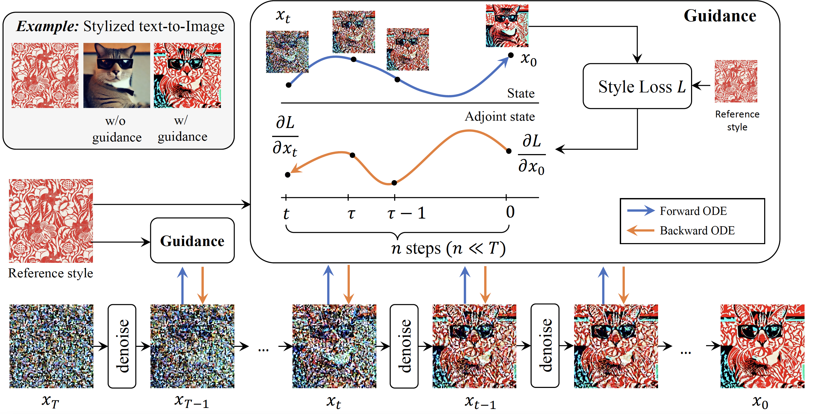
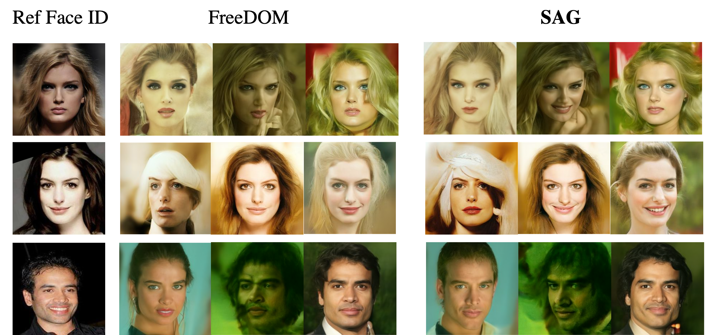
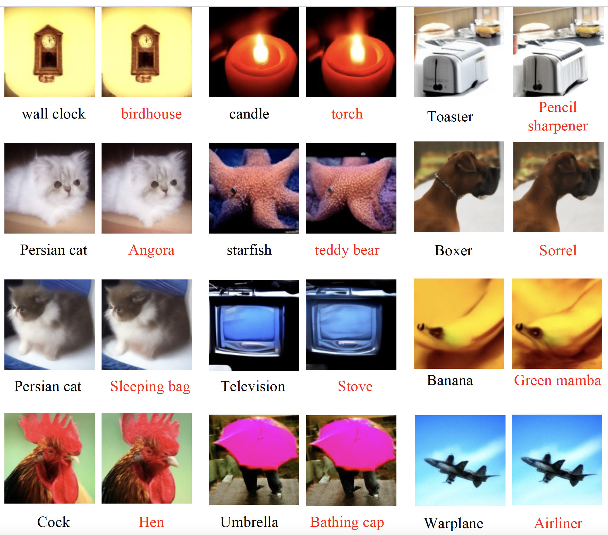

## Official Repo for 
- ## AdjointDPM: Adjoint Sensitivity Method for Gradient Backpropagation of Diffusion Probabilistic Models (ICLR 2024)
- ## Towards Accurate Guided Diffusion Sampling through Symplectic Adjoint Method

### [Paper1](https://openreview.net/pdf?id=y33lDRBgWI) | [Paper2](https://arxiv.org/pdf/2312.12030.pdf) | [Project Page] 


AdjointDPM is a method that can not only finetune the parameters of DPMs, including network parameters and text embedding, but also perform guided sampling with accurate gradient guidance, based on a differentiable metric defined on the generated contents. 

There are several interesting experiments to demonstrate the effectiveness of AdjointDPM. For the finetuning tasks, including stylization and text embedding inversion, they are implemented based on [adjoint](https://github.com/HanshuYAN/AdjointDPM/tree/main/adjoint) (Coming soon). For the guided sampling, they are implemented in [img_guided_sampling](https://github.com/HanshuYAN/AdjointDPM/tree/main/img_guided_sampling). For security auditing under an ImageNet classifier, we implement the code heavily based on [dpm-solver](https://github.com/LuChengTHU/dpm-solver/tree/main/examples/ddpm_and_guided-diffusion) codebase. Check it in [ddpm_and_guided-diffusion](https://github.com/HanshuYAN/AdjointDPM/tree/main/ddpm_and_guided-diffusion). 


## Setup

First, download and set up the repo:

```bash
git clone https://github.com/HanshuYAN/AdjointDPM.git
cd AdjointDPM
```

We provide an [`environment.yml`](environment.yml) file that can be used to create a Conda environment. 

```bash
conda env create -f environment.yml
conda activate adjoint
```
## Guided Sampling

We propose Symplectic Adjoint Guidance (SAG), a training-free guided diffusion process that supports various image and video generation tasks, including style-guided image generation, aesthetic improvement, personalization and video stylization. We illustrate the framework of training-free guided generation through symplectic adjoint guidance using a stylization example. When we denoise  Gaussian noise to an image across various steps, we can add guidance (usually defined as gradients of loss function on the estimate of $\hat{\mathbf{x}}_0$ based on $\\mathbf{x}_t$) to each step. Different from previous works which approximate $\hat{\mathbf{x}}_0$ based on $\mathbf{x}_t$ using one step, we estimate $\hat{\mathbf{x}}_0$ using $n$ steps $(n\ll T)$ by solving a forward ODE. Then we use the symplectic adjoint method to solve a backward ODE to obtain the gradients. These gradients guide the diffusion generation process to be closer to the reference image. 

<p align="middle">
  
</p>

To run guided sampling using symplectic adjoint method, we need to install symplectic torchdiffeq: 

```bash
cd img_guided_sampling
cd symplectic-adjoint-method-beta
python setup.py install
```


### Style-guided sampling
One can use SAG to do stylization in both image and video generation. 
<p align="middle">
  
</p>

<p align="middle">
  
</p>


### Aesthetic-guided sampling
One can improve the aesthetic quality of generated outputs by using SAG.
<p align="middle">
  
</p>

### Personalization
One can also do personalization by using SAG.
<p align="middle">
  
</p>

## Security Auditing 

One can do adversarial attack by using our proposed AdjointDPM. We show some adversarial examples against the ImageNet classifier. We show the originally generated images with their class names on the left; these images are correctly classified by ResNet50. On the
right, we show the corresponding adversarial images which successfully mislead the classifier. 
<p align="middle">
  
</p>
